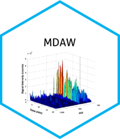

```{r, include = FALSE}
knitr::opts_chunk$set(
  collapse = TRUE,
  comment = "#>",
  fig.path = "man/figures/README-",
  out.width = "100%"
)
```

# {MDAW} <br>**M***etabolomic ***D***ata ***A***nalysis ***W***orkflow* <a href="https://danymukesha.github.io/MDAW/"></a>

## Getting started

[Introduction](https://danymukesha.github.io/MDAW/articles/Introduction.html)

`MDAW` is a computational workflow for statistical analysis of untargeted
and targeted metabolomic data.
