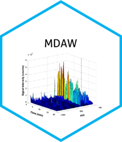

# {MDAW} 

**M***etabolomic ***D***ata ***A***nalysis ***W***orkflow*

## Getting started

[Introduction](https://danymukesha.github.io/MDAW/articles/Introduction.html)

`MDAW` is a computational workflow for statistical analysis of
untargeted and targeted metabolomic data.
